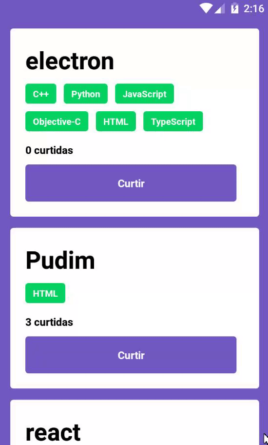

# RocketSeat NodeJS Frontend Mobile Exercise

The third exercise for the GoStack bootcamp (11th edition). A simple introductory application that follows the backend and web frontend exercises. This one is a simple interface so the user can give a thumbs up to the registered repositories.

### Idea

This application will allow the users to visualize the data about their registered repositories and give an upvote to the ones that deserve it. The idea here is to practice the JSX orientation for React Native, styles and local api connection.

### Tasks

Here the user should be able to:

- **`Be able to add list the repositories`**: The user can see all the registered repositories, (rendered in a flatlist) and all the technologies used for that project.

- **`Be able to upvote a repository`**: The user should be able to click on a "like" button, which will create the upvote item to the database via `POST` method and have the updated server data displayed on screen.

**`NOTE`**: Buttons and text are in Portuguese because the tester expects them to be like that.

### Running and Testing

This application will can be executed with the command `yarn start` (if you use yarn) or `npm start` and expects the backend from the previous exercise to be running at port `3333`. To be tested via Jest.js, run the commands `yarn test` or `npm run test`. The test can be ran regardless of the previous exercise's backend.
